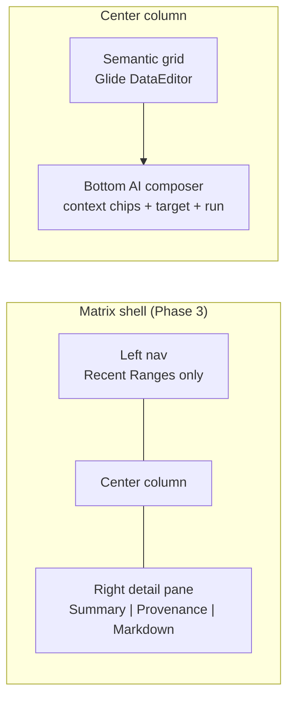

# Context Matrix — screen layout

Maps mockup zones → planned React components → delivery phase → `data-testid`. **Bold** = exists in repo today.

## Layout diagram



ASCII equivalent:

```
┌─────────────┬──────────────────────────────────┬──────────────────┐
│ Left nav    │  Semantic grid (glide-data-grid) │ Detail pane      │
│ · Recent    │                                  │ [Markdown] Ph1   │
│   Ranges    │                                  │ [Summary] Ph2    │
│             │                                  │ [Provenance] Ph2 │
├─────────────┴──────────────────────────────────┤                  │
│ Bottom composer: [ctx chip][ctx chip] target…  │                  │
│ [Run]                                          │                  │
└────────────────────────────────────────────────┴──────────────────┘
     ▲ App.tsx ViewToggle (Canvas | Matrix) — top-level, Phase 0
```

---

## Zone map

| Mockup zone | Component (planned) | Phase | data-testid (planned) | Current file / status |
| --- | --- | --- | --- | --- |
| **View toggle** | `ViewToggle` in `App.tsx` | **0** | `view-toggle` (add) | **Built** — button text "Matrix" / "Canvas", no testid yet |
| Left nav — Recent Ranges | `MatrixLeftNav` → `RecentRangeList` | 3 | `matrix-left-nav`, `recent-range-list` | **Not built** |
| Left nav — Projects / Templates | `ProjectList`, `TemplateList` | post–4b | — | **Deferred** |
| Left nav — History | `MatrixLeftNav` → `HistoryList` | 4b | `history-list` | **Not built** |
| Center grid | `MatrixGrid` (extract from `MatrixCanvas`) | **0** / 3 | `matrix-grid` | **Partial** — `DataEditor` in `MatrixCanvas.tsx`, no wrapper testid |
| Column role headers | `SemanticColumnHeaders` | 3 | `column-header-{role}` | **Not built** — Glide shows A/B/C via `formatColumnLabel` |
| Cell status chip | `MatrixCellRenderer` adapter | 3 | `cell-status-{row}-{col}` | **Not built** |
| Range selection | Glide `onGridSelectionChange` | **0** | (grid internal) | **Built** in `MatrixCanvas.tsx` |
| Bottom composer bar | `MatrixComposer` | 1 / 3 | `matrix-composer` | **Partial** — `footer.matrix-composer` |
| Context range chip(s) | `ContextRangeChip` (×n) | 2 / 3 | `context-chip` (exists), `context-chip-{name}` | **Partial** — single selection label chip Phase 0 |
| Target range indicator | `TargetRangeChip` | 2 | `target-range-chip` | **Not built** |
| Composer input | `MatrixComposerInput` | 1 | `matrix-composer-input` | **Built** — disabled in Phase 0 |
| Run button | `MatrixRunButton` | 1 | `matrix-run` (rename from `mock-ai-run`) | **Partial** — `mock-ai-run` mock only |
| Status bar | reuses `v2-status-bar` | **0** | `matrix-status-bar` (add) | **Built** — no dedicated testid |
| Right detail pane shell | `MatrixDetailPane` | 1 / 3 | `matrix-detail-pane` | **Not built** — overlay `aside.matrix-side-panel` Phase 0 |
| Tab: Markdown | `DetailMarkdownTab` | **1** | `detail-tab-markdown`, `side-panel-textarea` | **Partial** — textarea in overlay side panel |
| Tab: Summary | `DetailSummaryTab` | 2 | `detail-tab-summary` | **Not built** |
| Tab: Provenance | `DetailProvenanceTab` | 2 | `detail-tab-provenance` | **Not built** — `Cell.provenance` exists in domain |
| Save / cancel actions | `DetailPaneActions` | **0** | `side-panel-save` | **Built** in overlay |

---

## Phase 0 actual structure (today)

```
App.tsx
├── ViewToggle                    ✅
└── MatrixCanvas.tsx              ✅ monolithic
    ├── .matrix-grid-container
    │   └── DataEditor            ✅
    ├── footer.matrix-composer    ✅ partial
    │   ├── .matrix-context-chip  ✅ [data-testid=context-chip]
    │   ├── input                 ✅ disabled
    │   └── button Mock AI        ✅ [data-testid=mock-ai-run]
    ├── aside.matrix-side-panel   ✅ overlay, not right rail
    └── .v2-status-bar            ✅
```

Supporting modules (Phase 0):

| Module | Path |
| --- | --- |
| Domain types | `apps/context-canvas/src/shared/domain.ts` (~L275+) |
| Reducer | `apps/context-canvas/src/core/matrix-reducer.ts` |
| Zod | `apps/context-canvas/src/shared/matrix-validation.ts` |
| Glide adapter | `apps/context-canvas/src/adapters/matrix-glide.ts` |

---

## Not built yet (by zone)

| Zone | Gap |
| --- | --- |
| Left nav | No shell; full width grid (Recent Ranges in Ph3; History in 4b) |
| Semantic columns | Alphabet headers only (Ph3) |
| Status chips | `frontmatter` stored but not rendered (Ph3) |
| Context vs target | Single selection chip; no named ranges (Ph1–2) |
| Composer | Input disabled; mock only (Ph1: real Run) |
| Detail pane | Overlay aside, markdown-only, no Summary/Provenance (Ph1–2) |
| Persistence | No matrix storage under `src/storage/` |
| History | No list UI or entries |

---

## Refactor intent (Phase 3)

Split `MatrixCanvas.tsx` when **Recent Ranges** left nav lands (Ph1–2 remain monolith):

```
MatrixShell.tsx          # layout grid
├── MatrixLeftNav.tsx
├── MatrixCenter.tsx
│   ├── MatrixGrid.tsx
│   └── MatrixComposer.tsx
└── MatrixDetailPane.tsx
```

State stays in a parent hook (`useMatrixWorkspace`) or context; **domain document remains source of truth** (same invariant as canvas).
